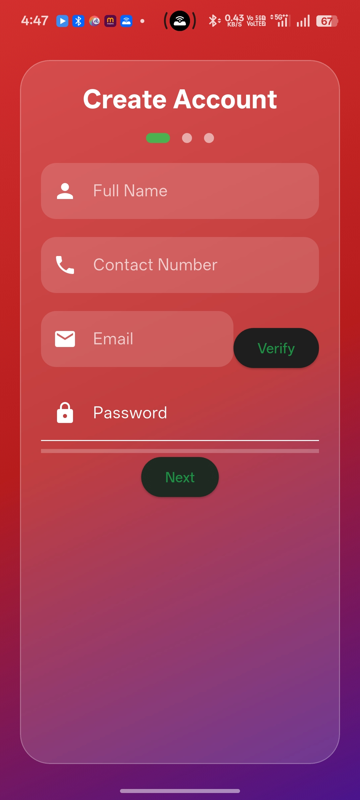
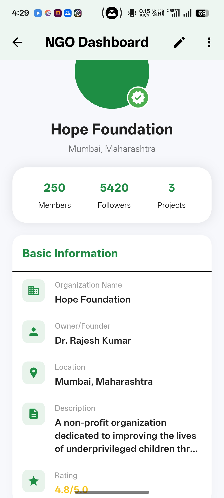
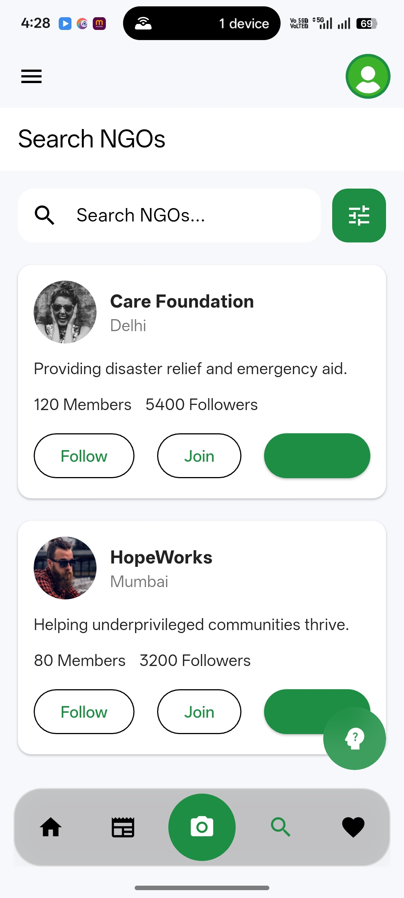

# UnityAid 🤝

> A comprehensive Flutter application connecting donors with NGOs and charitable causes

[](https://flutter.dev/)
[](LICENSE)

UnityAid is a mobile application designed to bridge the gap between donors and Non-Governmental Organizations (NGOs). The platform facilitates transparent donations, real-time communication, and community engagement for social causes.

---

## 📋 Table of Contents

- [Features](#features)
- [Screenshots](#screenshots)
- [Tech Stack](#tech-stack)
- [Installation](#installation)
- [Usage](#usage)
- [Project Structure](#project-structure)
- [Configuration](#configuration)
- [Contributing](#contributing)
- [License](#license)
- [Contact](#contact)

---

## ✨ Features

### For Donors
- 🔍 **Browse Donation Cases**: Discover verified charitable causes and donation campaigns
- 💳 **Secure Donations**: Make safe and transparent contributions to causes you care about
- 📰 **News Feed**: Stay updated with latest activities and impact stories
- 💬 **AI-Powered Chat**: Get assistance and answers to your queries
- 🔔 **Real-time Updates**: Track the impact of your donations

### For NGOs
- 📝 **Create Campaigns**: Post donation cases and fundraising campaigns
- 📊 **Dashboard Analytics**: Monitor donations and campaign performance
- ✅ **Verification System**: Get verified through DigiLocker integration
- 👥 **Community Engagement**: Connect with donors and share impact stories
- 📈 **Profile Management**: Showcase your organization's mission and achievements

### General Features
- 🔐 **Secure Authentication**: User and NGO login/signup functionality
- 🔍 **Advanced Search**: Find NGOs by category, location, and cause
- 📱 **Responsive Design**: Beautiful and intuitive user interface
- 🌙 **Theme Support**: Customizable app appearance
- 📸 **Media Sharing**: Upload and share images for campaigns and updates

---

## 📸 Screenshots

> Add your application screenshots here to showcase the UI and features

### Authentication Screens
| User Dashboard | Login | Sign Up |
|:------------:|:-----:|:-------:|
|  |  |  |

### User Interface
| Home Feed | Donation Cases | NGO Profile |
|:---------:|:--------------:|:-----------:|
|  |  |  |

### Features
| NGO Dashboard | Search | AI Chat |
|:-------------:|:------:|:-------:|
|  |  |  |

### Create Post & Settings
| News | Settings | Verification |
|:----------:|:--------:|:------------:|
|  |  |  |

**📝 Note**: Create a `screenshots` folder in the root directory and add your app screenshots with the corresponding names.

---

## 🛠️ Tech Stack

### Frontend
- **Framework**: [Flutter](https://flutter.dev/) (SDK 3.0+)
- **Language**: Dart
- **State Management**: Provider

### Key Dependencies
- `image_picker` - Image selection functionality
- `cached_network_image` - Efficient image loading and caching
- `url_launcher` - Launch URLs and external links
- `provider` - State management solution
- `cupertino_icons` - iOS-style icons

### Integrations
- DigiLocker API for NGO verification
- Payment Gateway (for donations)
- AI Chat Service

---

## 🚀 Installation

### Prerequisites
- Flutter SDK (3.0 or higher)
- Dart SDK (included with Flutter)
- Android Studio / VS Code
- Git

### Steps

1. **Clone the repository**
   ```bash
   git clone https://github.com/yourusername/unityaid.git
   cd unityaid
   ```

2. **Install dependencies**
   ```bash
   flutter pub get
   ```

3. **Run the app**
   ```bash
   # For Android
   flutter run

   # For iOS (macOS only)
   flutter run -d ios

   # For Web
   flutter run -d chrome
   ```

4. **Build APK (Android)**
   ```bash
   flutter build apk --release
   ```

5. **Build iOS App (macOS only)**
   ```bash
   flutter build ios --release
   ```

---

## 📖 Usage

### For Donors

1. **Sign Up**: Create an account as a donor
2. **Browse**: Explore donation cases and NGO profiles
3. **Donate**: Select a cause and make a contribution
4. **Track**: Monitor the impact of your donations through updates

### For NGOs

1. **Register**: Sign up as an NGO
2. **Verify**: Complete verification through DigiLocker
3. **Create Campaigns**: Post donation cases and fundraising campaigns
4. **Engage**: Share updates and communicate with donors
5. **Monitor**: Track donations and campaign performance through the dashboard

---

## 📁 Project Structure

```
unityaid/
├── android/                 # Android-specific files
├── assets/
│   └── images/             # Image assets
├── lib/
│   ├── main.dart           # App entry point
│   ├── data/               # Sample data
│   │   ├── sample_donation_cases.dart
│   │   ├── sample_ngo_data.dart
│   │   └── sample_user_data.dart
│   ├── models/             # Data models
│   │   ├── chat_message_model.dart
│   │   ├── donation_case_model.dart
│   │   ├── ngo_model.dart
│   │   ├── post_model.dart
│   │   └── user_model.dart
│   ├── screens/            # UI screens
│   │   ├── ai_chat/        # AI chatbot interface
│   │   ├── create_post/    # Post creation
│   │   ├── donate/         # Donation flow
│   │   ├── home/           # Home screen
│   │   ├── news_feed/      # News feed
│   │   ├── ngo_home/       # NGO dashboard
│   │   ├── ngo_search/     # NGO search
│   │   ├── settings/       # Settings
│   │   ├── signup/         # Registration
│   │   └── user_home/      # User dashboard
│   └── widgets/            # Reusable widgets
│       ├── auth_widgets.dart
│       ├── digilocker_button.dart
│       └── theme/          # Theme configurations
├── pubspec.yaml            # Dependencies
└── README.md               # This file
```

---

## ⚙️ Configuration

### Environment Setup

Create necessary configuration files for API keys and secrets:

```dart
// lib/config/api_config.dart
class ApiConfig {
  static const String digiLockerApiKey = 'YOUR_DIGILOCKER_KEY';
  static const String paymentGatewayKey = 'YOUR_PAYMENT_KEY';
  static const String aiChatApiKey = 'YOUR_AI_API_KEY';
}
```

### Firebase Setup (if applicable)

1. Create a Firebase project
2. Add Android/iOS apps to Firebase
3. Download `google-services.json` (Android) or `GoogleService-Info.plist` (iOS)
4. Place files in respective directories
5. Update dependencies in `pubspec.yaml`

---

## 🤝 Contributing

We welcome contributions to UnityAid! Here's how you can help:

1. **Fork the repository**
2. **Create a feature branch**
   ```bash
   git checkout -b feature/AmazingFeature
   ```
3. **Commit your changes**
   ```bash
   git commit -m 'Add some AmazingFeature'
   ```
4. **Push to the branch**
   ```bash
   git push origin feature/AmazingFeature
   ```
5. **Open a Pull Request**

### Guidelines
- Follow the existing code style
- Write meaningful commit messages
- Add comments for complex logic
- Test your changes thoroughly
- Update documentation as needed

---

## 📄 License

This project is licensed under the MIT License - see the [LICENSE](LICENSE) file for details.

---

## 📞 Contact

**Project Team**
- Project Name: UnityAid
- Course: Theory of App Development

**Links**
- Project Repository: [GitHub](https://github.com/yourusername/unityaid)
- Documentation: See additional README files
  - [NGO Dashboard Guide](NGO_DASHBOARD_README.md)
  - [NGO Dashboard Quick Reference](NGO_DASHBOARD_QUICKREF.md)
  - [Donation Cases Guide](DONATION_CASES_README.md)
  - [Migration Guide](MIGRATION_GUIDE.md)

---

## 🙏 Acknowledgments

- Flutter team for the amazing framework
- All contributors and supporters
- NGOs and charitable organizations using UnityAid
- Open source community

---

## 📈 Roadmap

- [ ] Implement real-time notifications
- [ ] Add multiple payment gateway options
- [ ] Enhanced analytics and reporting
- [ ] Multi-language support
- [ ] Dark mode theming
- [ ] Social media integration
- [ ] Export donation receipts
- [ ] Advanced search filters

---

## 📝 Additional Documentation

For more detailed information, check out these guides:

- **[NGO Dashboard README](NGO_DASHBOARD_README.md)** - Comprehensive guide for NGO dashboard features
- **[NGO Dashboard Quick Reference](NGO_DASHBOARD_QUICKREF.md)** - Quick reference for NGO operations
- **[Donation Cases README](DONATION_CASES_README.md)** - Guide for managing donation cases
- **[Migration Guide](MIGRATION_GUIDE.md)** - Guide for migrating between versions

---

<div align="center">
  <p>Made with ❤️ for social good</p>
  <p>⭐ Star this repository if you find it helpful!</p>
</div>
