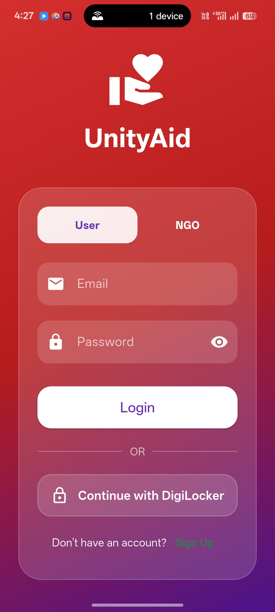
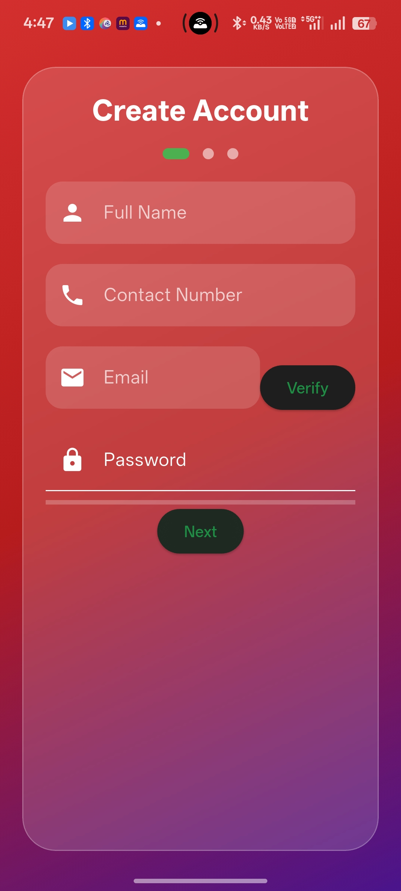
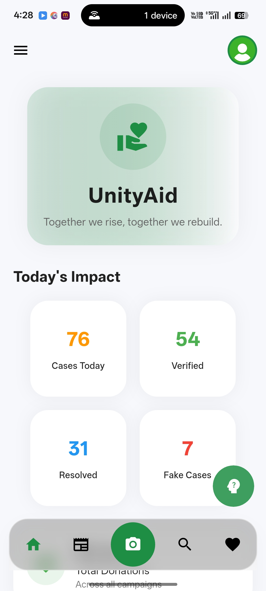
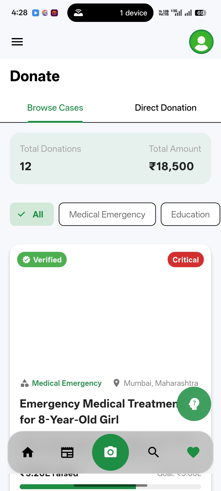
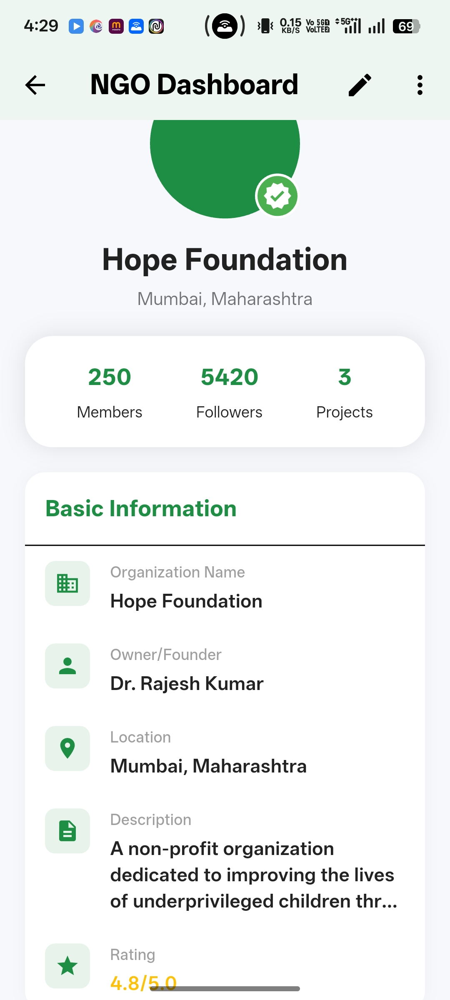
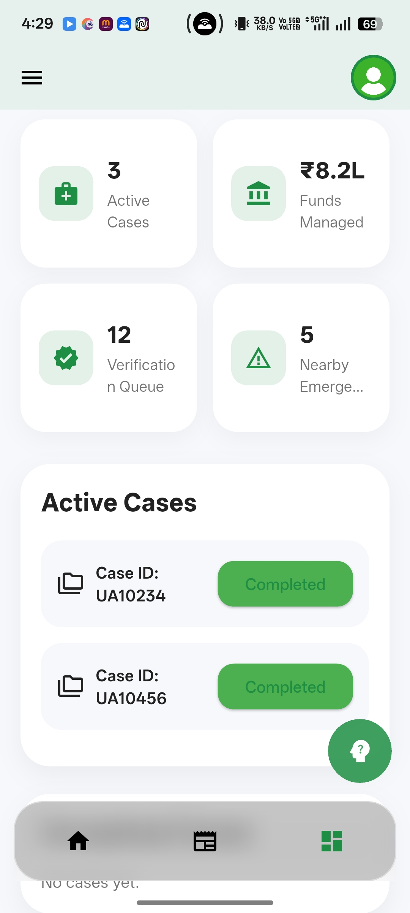
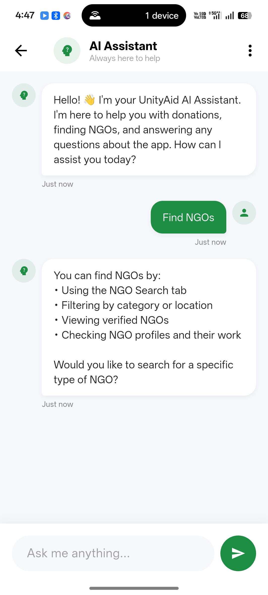

# UnityAid 🤝

> A comprehensive Flutter application connecting donors with NGOs and charitable causes

[](https://flutter.dev/)
[](https://firebase.google.com/)
[](LICENSE)

UnityAid is a mobile application designed to bridge the gap between donors and Non-Governmental Organizations (NGOs). The platform facilitates transparent donations, real-time communication, and community engagement for social causes.

---

## 📋 Table of Contents

- [Features](#-features)
- [Screenshots](#-screenshots)
- [Tech Stack](#-tech-stack)
- [Prerequisites](#-prerequisites)
- [Quick Start](#-quick-start)
- [Credentials Setup](#-credentials-setup)
- [Firebase Configuration](#-firebase-configuration)
- [Running the Project](#-running-the-project)
- [Project Structure](#-project-structure)
- [Contributing](#-contributing)
- [License](#-license)

---

## ✨ Features

### For Donors
- 🔍 **Browse Donation Cases** — Discover verified charitable causes
- 💳 **Secure Donations** — Razorpay payment gateway integration
- 📰 **News Feed** — Stay updated with latest activities
- 💬 **AI-Powered Chat** — Get assistance and answers
- 🔔 **Real-time Notifications** — Track donation impact via FCM
- 🛡️ **Deepfake Detection** — Image authenticity verification

### For NGOs
- 📝 **Create Campaigns** — Post donation cases and fundraising campaigns
- 📊 **Dashboard Analytics** — Monitor donations and performance
- ✅ **DigiLocker Verification** — Verified NGO status
- 👥 **Community Engagement** — Share updates with donors

### General
- 🔐 **Authentication** — Email/Password + Google Sign-In
- 🗺️ **Google Maps** — Location-based NGO discovery
- 🌙 **Dark/Light Theme** — Full theme support with Provider
- 📸 **Media Uploads** — Firebase Storage image management
- 📱 **Responsive Design** — Beautiful, animated UI

---

## 📸 Screenshots

| User Dashboard | Login | Sign Up |
|:------------:|:-----:|:-------:|
|  |  |  |

| Home Feed | Donation Cases | NGO Profile |
|:---------:|:--------------:|:-----------:|
|  |  |  |

| NGO Dashboard | Search | AI Chat |
|:-------------:|:------:|:-------:|
|  |  |  |

---

## 🛠️ Tech Stack

| Layer | Technology |
|-------|-----------|
| **Frontend** | Flutter 3.0+, Dart, Provider |
| **Backend** | Firebase Cloud Functions (TypeScript) |
| **Database** | Cloud Firestore |
| **Auth** | Firebase Auth (Email + Google Sign-In) |
| **Storage** | Firebase Storage |
| **Messaging** | Firebase Cloud Messaging (FCM) |
| **Payments** | Razorpay |
| **Maps** | Google Maps Flutter |
| **Data API** | Firebase DataConnect (GraphQL) |

---

## 📦 Prerequisites

| Tool | Version | Check |
|------|---------|-------|
| **Flutter SDK** | 3.0+ | `flutter --version` |
| **Node.js** | 18+ | `node -v` |
| **npm** | 9+ | `npm -v` |
| **Java JDK** | **21+** ⚠️ | `java -version` |
| **Firebase CLI** | Latest | `firebase --version` |
| **Git** | Any | `git --version` |

> ⚠️ **Java 21+** is required for Firebase Emulators. Download from [Adoptium](https://adoptium.net/).

```bash
# Install Firebase CLI
npm install -g firebase-tools
firebase login
```

---

## 🚀 Quick Start

```bash
# 1. Clone the repository
git clone https://github.com/yourusername/Unity_Aid.git
cd Unity_Aid
git checkout nikhil

# 2. Set up credentials (see section below)

# 3. Backend setup
cd backend/functions
npm install
npm run build
cd ../..

# 4. Frontend setup
cd frontend
flutter pub get
cd ..

# 5. Start Firebase Emulators (Terminal 1)
cd backend
firebase emulators:start

# 6. Run Flutter app (Terminal 2)
cd frontend
flutter run
```

---

## 🔐 Credentials Setup

The following files contain **secrets** and are **NOT in the repo**. Create them locally:

### Files You Must Create

| File | Location | How to Get |
|------|----------|-----------|
| `google-services.json` | `frontend/android/app/` | Firebase Console → Project Settings → Android app → Download |
| `GoogleService-Info.plist` | `frontend/ios/Runner/` | Firebase Console → iOS app → Download |
| `firebase_options.dart` | `frontend/lib/` | Run `flutterfire configure` in `frontend/` |
| `.firebaserc` | `backend/` | Run `firebase use --add` |
| `serviceAccountKey.json` | `backend/` | Firebase Console → Service Accounts → Generate Key |
| `.env` | `backend/` & `frontend/` | Copy from `.env.example` |

### Step-by-Step

```bash
# 1. Generate firebase_options.dart
cd frontend
dart pub global activate flutterfire_cli
flutterfire configure

# 2. Link Firebase project
cd ../backend
firebase login
firebase use --add   # Select your Firebase project

# 3. Copy env files
cp backend/.env.example backend/.env
cp frontend/.env.example frontend/.env

# 4. Enable these in Firebase Console:
#    - Authentication → Email/Password + Google
#    - Cloud Firestore → Create database
#    - Storage → Create bucket
#    - Cloud Messaging (auto-enabled)
```

---

## 🔥 Firebase Configuration

### `backend/.firebaserc` (create this)
```json
{
  "projects": {
    "default": "unity-aid-e8db3"
  }
}
```

### Emulator Ports (pre-configured in `firebase.json`)

| Service | Port | UI |
|---------|------|----|
| **Emulator UI** | 4000 | http://localhost:4000 |
| Auth | 9099 | http://localhost:4000/auth |
| Firestore | 8080 | http://localhost:4000/firestore |
| Functions | 5001 | http://localhost:4000/functions |
| Storage | 9199 | http://localhost:4000/storage |
| Pub/Sub | 8085 | — |

### Deploy to Production
```bash
cd backend
firebase deploy              # Deploy everything
firebase deploy --only functions
firebase deploy --only firestore:rules
firebase deploy --only storage
```

---

## ▶️ Running the Project

You need **two terminals** running simultaneously.

### Terminal 1 — Backend
```bash
cd backend/functions
npm run build           # Compile TypeScript
cd ..
firebase emulators:start
```

### Terminal 2 — Frontend
```bash
cd frontend
flutter pub get
flutter run             # Run on connected device

# Or run on specific device:
flutter run -d chrome   # Web
flutter run -d <device> # Android/iOS
```

### Useful Commands

| Command | Description | Directory |
|---------|-------------|-----------|
| `npm run build` | Compile TS functions | `backend/functions/` |
| `npm run build:watch` | Auto-compile on save | `backend/functions/` |
| `firebase emulators:start` | Start emulators | `backend/` |
| `flutter pub get` | Install dependencies | `frontend/` |
| `flutter run` | Run debug app | `frontend/` |
| `flutter build apk --release` | Build APK | `frontend/` |
| `firebase functions:log` | View function logs | `backend/` |

---

## 📁 Project Structure

```
Unity_Aid/
├── backend/                        # Firebase Backend
│   ├── dataconnect/                # GraphQL API (DataConnect)
│   ├── functions/                  # Cloud Functions (TypeScript)
│   │   ├── src/
│   │   │   ├── index.ts            # Entry point
│   │   │   ├── config.ts           # Firebase Admin init
│   │   │   ├── types/              # Shared interfaces
│   │   │   ├── utils/              # FCM helpers
│   │   │   └── triggers/           # Firestore triggers
│   │   ├── package.json
│   │   └── tsconfig.json
│   ├── firebase.json               # Emulator & service config
│   ├── firestore.rules             # Database security rules
│   ├── firestore.indexes.json      # Query indexes
│   └── storage.rules               # Storage security rules
│
├── frontend/                       # Flutter App
│   ├── android/                    # Android project
│   ├── lib/
│   │   ├── main.dart               # App entry (Firebase init)
│   │   ├── firebase_options.dart   # Firebase keys (gitignored)
│   │   ├── login_page.dart         # Auth screen
│   │   ├── models/                 # Data models
│   │   ├── screens/                # All UI screens
│   │   ├── services/               # Backend services
│   │   │   ├── auth_service.dart
│   │   │   ├── user_service.dart
│   │   │   ├── notification_service.dart
│   │   │   ├── upload_service.dart
│   │   │   ├── razorpay_payment_service.dart
│   │   │   ├── deepfake_detection_service.dart
│   │   │   └── location_service.dart
│   │   └── widgets/                # Reusable components
│   ├── assets/                     # Images & static files
│   └── pubspec.yaml                # Dependencies
│
├── others/                         # Recommendation engine docs
├── screenshots/                    # App screenshots
├── LICENSE
└── README.md
```

---

## 🤝 Contributing

1. Fork the repo
2. Create a branch: `git checkout -b feature/YourFeature`
3. Commit: `git commit -m 'Add YourFeature'`
4. Push: `git push origin feature/YourFeature`
5. Open a Pull Request

---

## 📄 License

MIT License — see [LICENSE](LICENSE) for details.

---

<div align="center">
  <p>Made with ❤️ for social good</p>
  <p>⭐ Star this repository if you find it helpful!</p>
</div>
